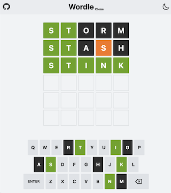

# Wordle Vue

Clone of the popular [Wordle](https://www.nytimes.com/games/wordle) game implemented with Vue 3/Vite and WindiCSS.

[Demo here](http://wordle-vue.lyfing.dev)




## Rules
- Six tries to guess the word
- Each guess must be a valid 5-letter English word
- The color tile change to show how you are to the word
- Tile color
  - 🟩 Letter is in the correct spot 
  - 🟧 Letter is in the word but in the wrong spot 
  - ⬛ Letter is not in the word

## Local setup

```shell
$ yarn install
$ yarn dev
```

## Features
- Random word
- Animation
  - Shake row on eror
  - Stagger on row revealing
  - Keyboard press feedback
- Save game state in local storage
- Mobile responsive
- Light/Dark mode
