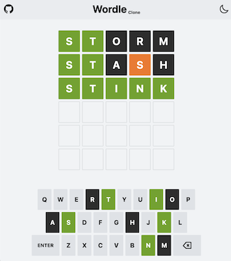

# Wordle Vue

A faithful clone of the [New York Times Wordle](https://www.nytimes.com/games/wordle) built with Vue 3, Vite, and WindiCSS.

[**Play the demo**](http://wordle-vue.lyfing.dev) &nbsp;·&nbsp; [Source on GitHub](https://github.com/peng-hf/wordle-vue)



## How to play

Guess the hidden 5-letter word in 6 tries. After each guess the tiles reveal how close you were:

| Color | Meaning |
|-------|---------|
| 🟩 Green | Correct letter, correct position |
| 🟧 Orange | Correct letter, wrong position |
| ⬛ Gray | Letter not in the word |

Only valid English words are accepted. The word changes every day.

## Features

- **Daily word** — a new puzzle every day, consistent for all players
- **Persistent state** — your progress is saved for 1 hour so you can close the tab and return
- **Color-coded keyboard** — keys reflect the best result seen for that letter across all guesses
- **Light / dark mode** — preference saved for 30 days
- **Fully responsive** — works on mobile, tablet, and desktop
- **Animations** — staggered tile reveal, row shake on invalid guess, key press feedback

## Keyboard shortcuts

| Key | Action |
|-----|--------|
| `A`–`Z` | Type a letter |
| `Enter` | Submit guess |
| `Backspace` | Delete last letter |
| `Shift + R` | Restart game _(desktop only)_ |

On mobile, tap anywhere on the end-of-game message to restart.

## Tech stack

| Library | Purpose |
|---------|---------|
| [Vue 3](https://vuejs.org/) | UI framework |
| [Vite](https://vitejs.dev/) | Build tool & dev server |
| [WindiCSS](https://windicss.org/) | Utility-first CSS |
| [Eva Icons](https://akveo.github.io/eva-icons/) | Icon set |

## Local setup

Requires **Node 18+**.

```sh
yarn install
yarn dev
```

Other available scripts:

```sh
yarn build    # production build
yarn preview  # preview the production build locally
yarn lint     # lint with ESLint
```

## License

MIT
